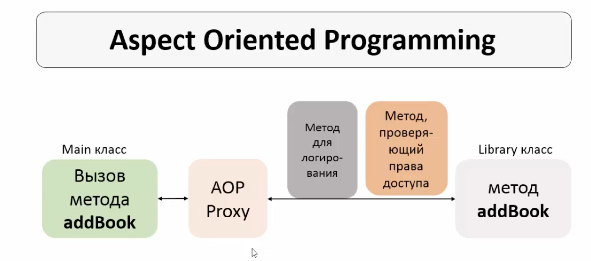

# Aspect Oriented Programming
Представим ситуацию, когда в методы какого-либо класса, содержащие бизнес-логику, нужно дробавить логирование, а позже еще и проверку прав доступа.

В этом случае происходит переплетение бизнес-логики со служебным функционалом, code tangling. Метод становится громоздким, его основной функционал теряется.

Так же появляется "размазанность" служебного функционала (логи, права) по всему проекту, code scattering. При необходимости изменения функционала нам придется править все классы.

**AOP**, это парадигма программирования, основанная на разделении основного и служебного функционала. Служебный функционал записывается в Aspect-классы.

В основе Aspect лежит сквозная логика, cross-cutting logic. Сквозной логикой в мире АОП называют служебный функционал. К сквозной логике относят логирование, проверку прав, обработку транзакций, обработку исключений, кэширование.



Логирование и прочие сквозные процессы не отображаются ни в Main, ни в Library классах, т.е. идет разделение кода.

Преимущества АОП:
- Сквозной функционал сосредоточен в одном или нескольких обособленных классах, его легче изменять.
- Легче добавлять новые сквозные работы, это достигается благодаря конфигурации аспектов.
- Бизнес-код приложения становится меньше и чище, работать с ним становится легче.

Недостатки:
- Требуется дополнительное время на работу аспектов. Это время незначительно, однако иногда и эта величина может быть критичной.

Существует фреймвоки для АОП:
- Spring AOP, простой в использованииб предоставляет самую распространенную и необходимую функциональность АОП.
- AspectJ предоставляет всю функциональность, более сложный в использовании.

## Advice тип @Before
Скачиваем пакет **AspectJ**

Мы хотим, чтоб при вызове метода **getBook()** происодило логирование, и чтобы оно происходило до основного функционала метода.
В конфигурационный файл добавляем аннотацию **@EnableAspectJAutoProxy**, создаем класс LoggingAspect, ставим на него аннотацию **@Aspect**

Advice, это метод, который находится в aspect-классе и выполняется при вызове метода getBook().
Создаём метод **beforeGetBookAdvice()**, ставим над ним аннотацию **@Before("execution(public void getBook())")**.
Элемент **execution(public void getBook())** называется pointcut, это выражение, которое показывает, где будет применен advice.

### Типы методов advice
- Before. Выполняется до метода с основной логикой
- After returning. Только после нормального окончания метода с основной логикой
- After throwing. после окончания метода с основной логикой, только если было выброшено исключение
- After/After finally. После окончания метода с основной логикой.
- Around. До и после метода с основной логикой.

## Pointcut
P., это выражение, указывающее, где будет применен advice. Spring AOP использует AspectJ Pointcut expression language, определенные правила для написания pointcut.

Шаблон для написания pointcut:  
**execution(** modifiers-pattern? **return-type-pattern** declaring-type-pattern?
**method-name-pattern(parameters-pattern)** throws-pattern?)
Жирным выделены обязательные элементы.

Если declaring-type-pattern не указан, и существуют методы в разных классах, подходящие под заданный шаблон, advice-метод будет выполнен для всех подходящих под шаблон методов.

FQDN определяет, метод какого класса будет выполнен:
```java
@Before("execution(public void aop.UniLibrary.getBook())")
```

Pointcut так же может использовать wildcard'ы. В примере ниже подходят все get-методы без параметров из любого класса пакета.
```java
@Before("execution(public void get*())")
```
