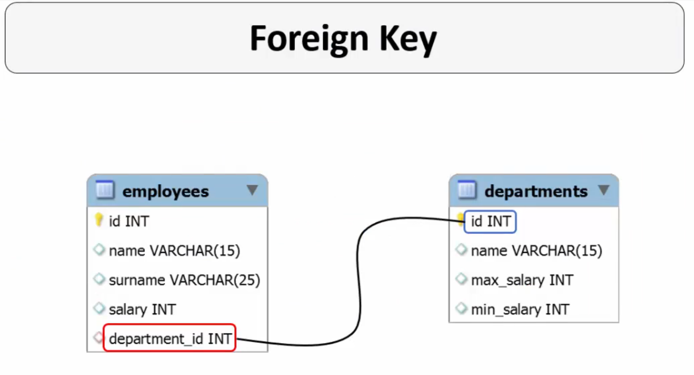
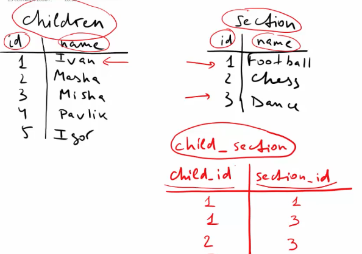
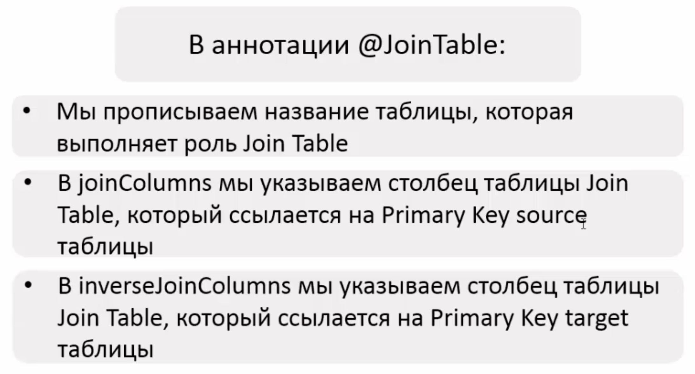
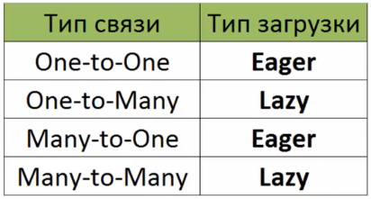

# Hibernate
Создаем файл src/main/java/hibernate.cfg.xml с конфигурацией Hibernate.
Подключаем PostgreSQL-коннектор: добавляем зависимость в мавен или качаем джарник и добавляем его к либам.

## Использование Docker-контейнеров
Иногда удобнее запускать БД в контейнере, нежели устанавливать ее на рабочий компьютер.
```shell
docker run -d -p 2345:5432 postgres
docker run -it -p 2345:5432 -e POSTGRES_PASSWORD=password postgres
.....
Digest: sha256:f4cd32e7a418d9c9ba043e7d561243388202b654c740bcc85ca40b41d9fb4f1e
Status: Downloaded newer image for postgres:latest
97ebdd169e5dae756fc19f9046720317a7c7ef821da4d2f97add313b112ae2e5
```
Настроить бд, раздать права. В консоли делать муторно, просто установил пароль для суперпользователя postgres и подключался им же.
```sql
create user alexey; --creating role
GRANT CONNECT ON DATABASE postgres TO alexey;

grant all privileges on database postgres to alexey;
grant all privileges on table employees to alexey; --optional?
alter user alexey password 'postgres';
```

## Связь между классом и таблицей
Конфигурируется с помощью XML-файла (старый способ) или с помощью Java-аннотаций.

Н. использует понятие entity-класс. Это POJO-класс, в котором используются определенные Н.-аннотации для связи класса с таблицей из БД.

### Создание entity-класса  
Создаем entity-класс, в котором указываем аннотацию @Entity и @Table с указанием имени таблицы. При совпадении имени таблицы и имени класса @Table можно не ставить (но лучше все равно ставить для улучшения читаемости). Аннотации берем из пакета javax.persistence.*. 

Создаем поля, конструктор без аргументов, конструктор с аргументами (для удобства создания объектов), геттеры и сеттеры и переопределим toString().

Все поля помечаются аннотациями **@Column(name="blabla")** с указанием названия столбца. Столбец с PK помечается **@Id**. Если имя столбца совпадает с именем поля, информацию name="bla" можно не писать. Указать **@GeneratedValue(strategy = GenerationType.IDENTITY)**, без нее не записывалось, Н. ругался на primary_key_constraint

```java
@Entity
@Table(name = "employees")
public class Employee {
    @Id
    @Column
    @GeneratedValue(strategy = GenerationType.IDENTITY)
    private int id;
    @Column
    private String name;
}
```
Стратегии:
- GenerationType.IDENTITY полагается на автоинкремент столбца по правилам, прописанным в БД.
- GenerationType.SEQUENCE - полагается на работу Sequence, хороша с точки зрения производительности, но поддерживается не всеми БД (можно использовать для БД Oracle).
- GenerationType.TABLE достаточно неэффективная стратегия, полагается на значение столбца таблицы БД. Цель - поддержка уникальности значений, используется отдельная таблица, значение столбца инкементируется вручную.
- GenerationType.AUTO - вариант по-умолчанию, зависит от используемой таблицы.

JPA, это стандартизированная спецификация, которая описывает сохранение Java-объектов в таблицы БД. Hibernate - самая популярная реализация спецификации JPA. Т.е. JPA описывает правила, а Hibernate реализует их. Иными словами, JPA описывает правила, Hibernate реализует их. Таким образом, при использовании JPA-аннотаций (java.persistence.*) мы можем легко поменять реализацию JPA с Hibernate на к-л другую.

### Создание сессии
Сессия, это обертка вокруг подключения к БД с помощью JDBC. Она является основой для работы с БД, с помощью сессии мы совершаем CRUD-операции.  
Чтобы создать сессию, сначала нужно создать sessionFactory. Ее создаем, указывая конфиг Н. Если файл конфигурации называется hibernate.cfg.xml, его имя можно не писать:
```java
SessionFactory factory = new Configuration()
        .configure("hibernate.cfg.xml")
        .addAnnotatedClass(Employee.class)
        .buildSessionFactory();
```

### Создание записи в БД
- Создаем транзакцию
- Совершаем CRUD-операции
- Закрываем транзакцию
```java
session.beginTransaction();
session.save(employee);
session.getTransaction().commit();
```
Сессия обязательно должна быть закрыта, поэтому код работы с бд нужно обернуть в try-catch.

### Получение записи из БД
```java
session.get(Employee.class, 14);
```

### Получение всех данных из таблицы
Выполним с помощью HQL:
```java
List<Employee> employeeList = session.createQuery("from Employee").getResultList();
List<Employee> alexanders = session
        .createQuery("from Employee where name = 'Alexander' and salary > 100")
        .getResultList();
```
 Employee здесь, это имя класса, а не название таблицы. name - название поля в классе Employee.

### Обновление данных
```java
session.beginTransaction();
Employee alexey = session.get(Employee.class, 0);
alexey.setSalary(500);
session.getTransaction().commit();
```
Создание запроса. Изменяем зарплату всех Александров:
```java
session.createQuery("update Employee set salary = 1000 where name = 'Alexander'").executeUpdate();
```

### Удаление
Удаление имеющегося экземпляра:
```java
Employee employee = session.get(Employee.class, 18);
session.delete(employee);
```
Удаление с помощью HQL-запроса:
```java
session.createQuery("delete Employee where name = 'Alexander'").executeUpdate();
```

## Типы отношений таблиц
### Один к одному
Создание таблиц для упражнений one to one:
```sql
CREATE TABLE details (id serial PRIMARY KEY, city VARCHAR (15), phone_number VARCHAR (25), email VARCHAR (30));
CREATE TABLE employees (
    id serial PRIMARY KEY, name varchar(15), surname varchar(25), department varchar(20),salary int, details_id int,
    constraint fk_details_id foreign key (details_id) references details(id)
);
```
Пример: Школа - диркетор.  
Uni-directional associations - отношения (ассоциации), в которых одна сторона об этих отношениях не знает. Например, человек знает, что у него есть номер телефона, а номер телефона не знает, что у него есть человек. Или еще пример: 
```java
class Employee {
    private Detail empDetail;
}

class Detail {}
```

Bi-directional associations, двунаправленные отношения - обе стороны знают друг о друге.
```java
class Employee {
    private Detail empDetai;
}

class Detail {
    private Employee employee;
}
```

При настройке направленности отношений нам не нужно "трогать" БД. Как настроить однонаправленное отношение "один к одному":
```java
import javax.persistence.CascadeType;

@OneToOne(cascade = CascadeType.All) // тип отношения
@JoinColumn(name = "details_id") // поле, на основе которого строится отношение
private Detail empDetail;
```
Аннотация **@JoinColumn(name = "details_id")** показывает, что для связи с классом Detail в таблице, которая связана с классом Employee (таблица employees), есть столбец details_id. Собственно, в этой аннотации указывается FK.
CascadeType.ALL, каскад операций, это выполнение операции не только для сущности, на которой операция вызывается, но и на других сущностях, связанных с этой сущностью. Пример такой операции, каскадное удаление. Когда мы удаляем работника, его детали так же удаляются. Каскадные операции применимы не ко всем типам отношений. Например, "департамент - работник", один ко многим. Удаляя департамент, мы не удаляем работников, и наоборот.  
Еще примеры работы каскадных операций: создаем работника, создаем его детали, сохраняем работника в базе, детали будут сохранены автоматически. Получив работника из базы, мы также получаем его детали. 

Как настроить двунаправленное отношение (опять же, БД не трогаем, только добавляем соответсвующую аннотацию): 
```java
@OneToOne(mappedBy = "empDetail")
private Employee employee;
```
Аннотация **@OneToOne(mappedBy = "empDetail")** говорит, что связь уже есть, и ее надо поискать в поле empDetail класса Employee.
При двунаправленной связи и настроенных каскадных операциях можно удалить работника по его деталям. Можно так же получить работника, имея его детали (details.getEmployee()). Чтобы удалить только детали, не трогая работника, нужно поменять значение CascadeType, например:
```java
@OneToOne(mappedBy = "empDetail", cascade = {CascadeType.REFRESH, CascadeType.PERSIST})
private Employee employee;
```

Детали имеют PK, столбец id. Он является FK для столбца details_id таблицы employees, поэтому мы не можем просто удалить детали, будет выброшено исключение **EntityNotFoundException: deleted object would be re-saved by cascade (remove deleted object from associations)**. Для этого сначала нужно очистить поле details_id у работника, чьи детали мы удаляем:
```java
detail.getEmployee().setEmpDetail(null);
session.delete(detail);
```

### Один ко многим, многие к одному
Пример: департамент - работник.  
Многие к одному - Перевернутый вариант отношения "Один ко многим", пример: работник - департамент.  
Создание таблиц для упражнений one to many:
```sql
CREATE TABLE departments (id serial primary key, name varchar(15), max_salary int, min_salary int);
CREATE TABLE employees (
    id serial primary key, name varchar(15), surname varchar(25), salary int, department_id int,
    constraint fk_department_id foreign key (department_id) references departments(id)
);
```

На картинке выше employees, это source-таблица, а departments - target-таблица. В связи "много к одному" (а это перевернутая связь "один ко многим") FK всегда находится в таблице, "где много".   
При использовании связи One-to-Many FK может находиться не в source-таблице, а в target-таблице. Мы все равно 
прописываем FK в аннотации @JoinColumn, и H. сам разберется, в какой таблице находится FK.
Настраиваем отношение. В том классе, к которому относятся много работников, используем тип поля List:
```java
@Entity
@Table(name = "departments")
public class Department {
    ...
    @OneToMany(cascade = CascadeType.ALL, mappedBy = "department")
    private List<Employee> emps;
    ...
}

@Entity
@Table(name = "employees")
public class Employee {
    ...
    @ManyToOne(cascade = CascadeType.ALL)
    @JoinColumn(name = "department_id")
    private Department department;
    ...
}
```
Добавляем метод addEmployeeToDepartment(Employee employee) в класс Department для привязки работников к их департаменту. Делаем проверку на существование списка работников emps.  
Создав двух работников, департамент и добавив работников в этот департамент, мы сохраняем в базу только департамент. Работники будут сохранены каскадной операцией:
```java
Department department = new Department("IT", 300, 1200);
Employee employee1 = new Employee("Alexey", "Grokhotov", 800);
Employee employee2 = new Employee("Elena", "Smirnova", 750);

department.addEmployeeToDepartment(employee1);
department.addEmployeeToDepartment(employee2);

session.beginTransaction();
session.save(department);
session.getTransaction().commit();
```

Опять же, благодаря каскадным операциям мы можем получить работников департамента, получив департамент:
```java
Department department = session.get(Department.class, 1);
System.out.println(department);
System.out.println(department.getEmps());
```
Так как связь двунаправленная, мы можем получить департамент "по работнику":
```java
Employee employee = session.get(Employee.class, 2);
System.out.println(employee);
System.out.println(employee.getDepartment());
```
При каскадном удалении происходит любопытное: когда удаляем работника, он удаляет департамент (срабатывает каскадная операция), а удаление департамента каскадно удаляет остальных работников этого департамента. Так же и при удалении только одного департамента все работники этого департамента будут удалены.   
Чтобы изменить такое поведение, изменяем стратегию каскадных операций: **@OneToMany(cascade = {CascadeType.PERSIST, CascadeType.DETACH, CascadeType.REFRESH, CascadeType.MERGE})**


### Многие ко многим
Кружок - ребенок. Для отслеживания связей м2м используются join-таблицы. Join Table отображает связь между строками двух других таблиц. Столбцы JT, это foreign key, которые ссылаются на первичные ключи связываемых таблиц.  
  
child_id, это fk в таблице child_section и он ссылается на pk таблицы children.  
section_id, это fk в таблице child_section и он ссылается на pk таблицы section.  
Создание таблиц для упражнений m2m:  
```sql
CREATE TABLE children (
    id serial primary key,
    name varchar(15),
    age int
);

CREATE TABLE sections (
    id serial primary key,
    name varchar(15)
);

CREATE TABLE child_section (
  child_id int,
  section_id int,
  PRIMARY KEY (child_id, section_id),
  constraint fk_child_id foreign key (child_id) references children(id),
  constraint fk_sections_id foreign key (section_id) references sections(id));
```

Конфигурация отношения:
```java
    @ManyToMany(cascade = CascadeType.ALL)
    @JoinTable(
            name = "child_section",
            joinColumns = @JoinColumn(name = "child_id"),
            inverseJoinColumns = @JoinColumn(name = "section_id")
    )
    private List<Section> sections;

@ManyToMany
@JoinTable(
    name = "child_section",
    joinColumns = @JoinColumn(name = "section_id"),
    inverseJoinColumns = @JoinColumn(name = "child_id")
)
private List<Child> children;
```


### Типы загрузки данных
- Eager. Связанные сущности загружаются сразу вместе с загрузкой основной сущности (при загрузке департамента загружаются сотрудники).
- Lazy. Связанные сущности загружаются только при первом обращении к ним. На практике чаще всего применяется lazy-загрузка.

Типы выборки по-умолчанию:  
  
Тип выборки прописывавется при определении типа связи:
```java
    @OneToMany(cascade = CascadeType.ALL, mappedBy = "department", fetch = FetchType.EAGER)
    private List<Employee> emps;
```
