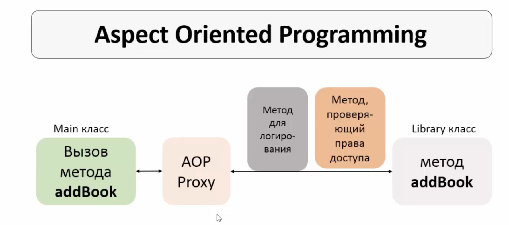

# IoC и DI
## Создание проекта c помощью Maven:
New project - Maven - tick Create from archetype - maven archetype quickstart
GroupId, Artifactid
Add spring-context dependency to pom-file
Create directory 'resources' in the project directory (IDEA suggests to create 'resources' folder either for main, or for test directories), mark it as 'resources root'.
Созданный класс App можно удалить.

## Spring Container
Это компонент, ответственный за создание и управление объектами. Контейнер читает созданный нами конфиг-файл и создает объекты, которые мы опишем в этом конфиг-файле. Когда нам требуется какой-либо объект, например, в файле с тестами, мы обращаемся к конейнеру и просим предоставить этот объект, а не создаем его сами.

Основные функции Spring Container'a:
	- Инверсия контроля: создание объектов и управление ими. То есть, не программист создает 		и управляет объектами, а сам спринг.
	- Внедрение зависимостей.
	
Способы конфигурации спринг контейнера:
	- XML-file (obsolete)
	- XML-file and annotations
	- Java configuration file

Spring Bean (Bean) - POJO created by Spring (not by a programmer).

Before we can create beans, we have to create Application Context. AC is basically a Spring Container.

DI помогает не запутаться в множестве зависимостей и иерархий. Зависимости можно внедрить с помощью конструктора, сеттеров, автовайринга.

### Constructor-based DI configuration with XML:
`    <bean id="myDog"
          class="org.agrokhotov.spring_introduction.Dog">
    </bean>

    <bean id="myPerson"
          class="org.agrokhotov.spring_introduction.Person">
        <constructor-arg ref="myDog"/>
    </bean> `
	
То же самое для анно-конфигурации:
`@Autowired
public Person(@Qualifier("dogBean") Pet pet) {}`
	
### Setter-based DI:
`    <bean id="myPerson"
          class="org.agrokhotov.spring_introduction.Person">
        <property name="pet" ref="myPet"/>
    </bean>`
	
Для анно-конфигурации просто ставим аннотацию **@Autowired** над полем.

## Внедрение значений
### XML-конфигурация
We can also inject 'hardcoded' values:
        <property name="surname" value="Alexey"/>

Or insert the values from .properties file:
`<context:property-placeholder location="classpath:myApp.properties"/> - specify .properites 
		<property name="surname" value="${person.surname}"/>`
		
### Анно-конфигурация
Для внедрения строк и других значений можно использовать аннотацию **@Value("valueItself")**. Например, над полями:

@Value("Alexey")
private String name;

При XML-конфигурации мы прописывали значения в XML- или properties-файлах. При конфигурации с помощью аннотаций значения можно обозначить, поставив в коде перед ними аннотацию **@Value**. Однако, это неоптимальный "захардкоженный" вариант. Гораздо лучше указать context:property-placeholder location, прописать эти значения в properties-файл и ссылаться из кода на них:

`@Value("${person.firstname}")
private String name;`

### Конфигурация с помощью Java-файла
Property-file указывается над классом конфигурации:
@Configuration
@PropertySource("classpath:myApp.properties")
public class MyConfig {}

Над полями так же указываются аннотации:
@Value("${person.surname}")
private String surname;

@Value()

## Область видимости бина
Scope (область видимости) бина определяет
	- жизненный цикл бина
	- возможное количество создаваемых бинов
	
Бывают синглтоны (скоуп по-умолчанию), прототипы, реквесты, сессии, глобальные сессии.
Синглтон создается сразу при чтении конфиг. файла Спрингом, является общим для всех, кто запросит этот файл (суть шаблона "синглтон"), подходит для stateless-объектов, объектов, состояние которых нам менять не приходится.

Прототип:
	- создается только после обращения к Спринг Контейнеру с помощью метода getBean()
	- для каждого такого обращения создается новый бин в Спринг Контейнере
	- пододит для stateful-объектов

### Определить скоуп:
### XML-конфигурация
`    <bean id="myPet"
          class="org.agrokhotov.spring_introduction.Dog"
          scope="singleton">
    </bean>`

### Анно-конфигурация
Для указания области видимости используем **@Scope("scopeType")**, например:

`@Component
@Scope("prototype")
public class Dog implements Pet {}`
	
	
## Жизненный цикл бина
1) Запускается приложение
2) Spring Container начинает работать
3) Создаются синглтон-бины
4) Внедряются зависимости
5) Выполняется init-метод. В этом методе мы обозначаем действия, которые должны быть выполнены при создании бина. Чаще всего это подключение к к-л ресурсам, БД, и тд.
6) Бин готов к использованию
7) Получаем бин с помощью getBean()
8) Завершение работы Спринг Контейнера с помощью .close()
9) Выполняется destroy-метод. Здесь пишется логика, которая должна выполняться по окончанию работы с бином. Часто это методы, закрывающие ресурсы и подключения.
10) Останавливается приложение

## Объявление init- и destroy- методов:
Эти методы могут называться как угодно, быть с любым модификатором доступа, с любым возвращаемым типом (возвращаемое значение использовать не получится, поэтому чаще всего используют void), обязательно без параметров.

Если у бина область видимости prototype:
	- для каждого созданного бина выполняется init-метод
	- destroy-метод для каждого нового созданного бина не вызывается
	- закрывать/освобождать занимаемые бином ресурсы придется самостоятельно
	
### XML-конфигурация
создаем init() и destroy() в классе.
прописываем их в applicationContext.xml

`    <bean id="myPet"
          class="org.agrokhotov.spring_introduction.Dog"
          scope="prototype"
          init-method="init"
          destroy-method="destroy">
    </bean>`
	
### Анно-конфигурация
@PostConstruct
public void init() {}

@PreDestroy
public void destroy() {}

Эти аннотации - часть Java EE и были признаны устаревшими с версии 9. Для их использования нужно добавить зависимость в maven:
`<dependency>
    <groupId>javax.annotation</groupId>
    <artifactId>javax.annotation-api</artifactId>
    <version>1.3.2</version>
</dependency>`

## Конфигурация с помощью аннотаций:
1) сканирование классов и поиск @Component
2) при наличии **@Autowired** создание (регистрация для прототипа, он сразу не создаётся) бина в Спринг Контейнере
3)  - если подходящих бинов нет, выбрасывается исключение
	- если бин подходит, внедряется зависимость
	- если подходит больше одного бина, выбрасывыется исключение 

Указываем пакет, в котором сканировать аннотацию **@Component**
<context:component-scan base-package="org.agrokhotov.spring_introduction"/>

Над объявлением класса прописываем @Component[("bean-name")]
Если имя бина не обозначено, Спринг назначит имя самостоятельно, заменив заглавную букву в названии класса на строчную. Если в названии класса мининмум две начальные буквы заглавные, Спринг оставляет название бина без изменения.

Начиная со Spring 4.3 можно не писать **@Autowired** для конструктора, если он единственный в классе. Но лучше, конечно, всё равно писать :)

Можно так же поставить эту аннотацию над сеттером или любым другим методом, зависимость внедрится.

Если в Спринг Контейнере больше чем один бин подходит для инъекции, нужно под аннотацией **@Autowired** добавить **@Qualifier("beanId")**. Для конструктора аннотация @Qualifier("beanId") пишется перед параметром конструктора:

`@Autowired
public Person(@Qualifier("dogBean") Pet pet) {}`

## Конфигурация с помощью Java code
### Способ 1
Поставить аннотации **@Configuration** и **@ComponentScan("packageName")** над классом, содержащим конфигурацию. Первая аннотация показывает, что этот класс описывает конфигурацию Спринг, вторая показывает, какой пакет нужно сканировать для поиска компонентов Спринга.

Application context создается с помощью другого класса:
AnnotationConfigApplicationContext context = new AnnotationConfigApplicationContext(SpringConfig.class);

### Способ 2
В этом способе не происходит сканирования компонентов, поэтому отсутствует необходимость писать аннотации **@ComponentScan** и **@Component**.

Бины описываются в конфигурационном файле:
    @Bean
    public Pet catBean() {
        return new Cat();
    }

    @Bean
    public Person personBean() {
        return new Person(catBean());
    }
 
# Aspect Oriented Programming
Представим ситуацию, когда в методы какого-либо класса, содержащие бизнес-логику, нужно дробавить логирование, а позже еще и проверку прав доступа. 

В этом случае происходит переплетение бизнес-логики со служебным функционалом, code tangling. Методв становится громоздким, его основной функционал теряется. 

Так же появляется "размазанность" служебного функционала (логи, права) по всему проекту, code scattering. При необходимости изменения функционала нам придется править все классы.

**AOP**, это парадигма программирования, основанная на разделении основного и служебного функционала. Служебный функционал записывается в Aspect-классы.

Cross-cutting logic, сквозная логика лежит в основе Aspect. Сквозной логикой в мире АОП называют служебный функционал. К сквозной логике относят логирование, проверку прав, обработку транзакций, обработку исключений, кэширование.

Логирование и прочие сквозные процессы не отображаются ни в Main, ни в Library классах, т.е. идет разделение кода.

Преимущества АОП:
- Сквозной функционал сосредоточен в одном или нескольких обособленных классах, его легче изменять.
- Легче добавлять новые сквозные работы, это достигается благодаря конфигурации аспектов.
- Бизнес-код приложения становится меньше и чище, работать с ним становится легче.

Недостатки:
- Требуется дополнительное время на работу аспектов. Это время незначительно, однако иногда и эта величина может быть критичной.

Существует фреймвоки для АОП: 
- Spring AOP, простой в использованииб предоставляет самую распространенную и необходимую функциональность АОП.
- AspectJ предоставляет всю функциональность, более сложный в использовании.

